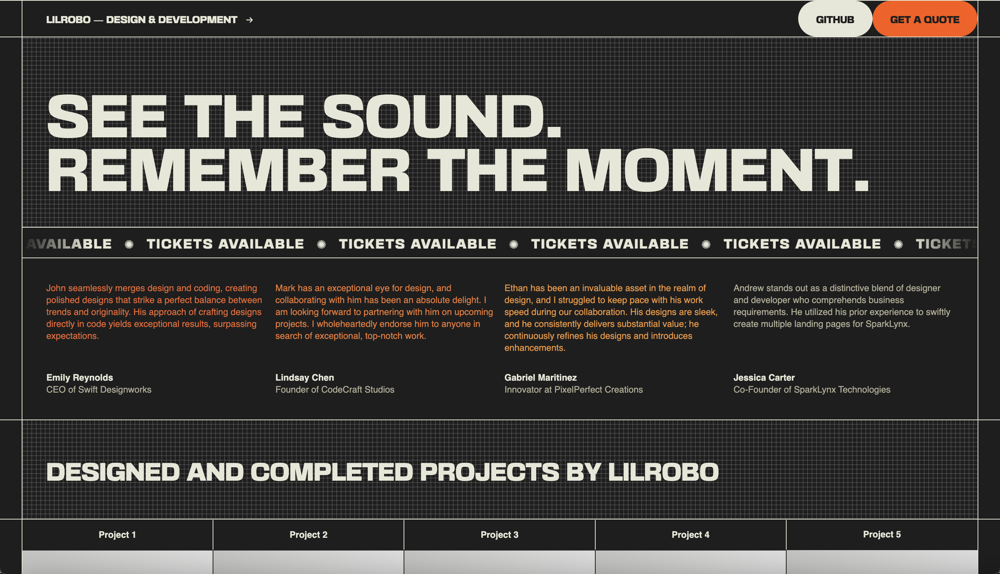

# Astro & Tailwind CSS Starter Kit by lexingtonthemes.com

## Template Integrations
- @astrojs/tailwind - https://docs.astro.build/en/guides/integrations-guide/tailwind/
- @astrojs/sitemap - https://docs.astro.build/en/guides/integrations-guide/sitemap/
- @astrojs/mdx - https://docs.astro.build/en/guides/markdown-content/
- @astrojs/rss - https://docs.astro.build/en/guides/rss/
- @astrojs/prism - https://docs.astro.build/en/reference/api-reference/#prism-
- Astrolib SEO - https://github.com/onwidget/astrolib/tree/main/packages/seo
## Template Structure

Inside of your Astro project, you'll see the following folders and files:

```
/
├── public/
├── src/
│   └── pages/
│       └── index.astro
└── package.json
```

Astro looks for `.astro` or `.md` files in the `src/pages/` directory. Each page is exposed as a route based on its file name.

There's nothing special about `src/components/`, but that's where we like to put any Astro/React/Vue/Svelte/Preact components.

Any static assets, like images, can be placed in the `public/` directory.

## Commands

All commands are run from the root of the project, from a terminal:

| Command                | Action                                           |
| :--------------------- | :----------------------------------------------- |
| `npm install`          | Installs dependencies                            |
| `npm run dev`          | Starts local dev server at `localhost:3000`      |
| `npm run build`        | Build your production site to `./dist/`          |
| `npm run preview`      | Preview your build locally, before deploying     |
| `npm run astro ...`    | Run CLI commands like `astro add`, `astro check` |
| `npm run astro --help` | Get help using the Astro CLI                     |

## Want to learn more?

Feel free to check Astros [documentation](https://docs.astro.build)

# Preview


